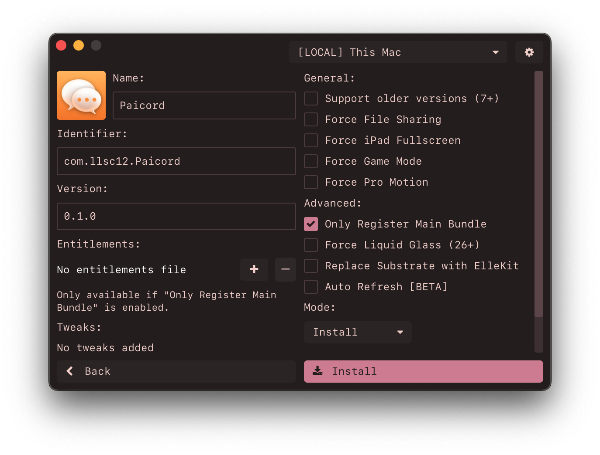

#  Impactor

[](https://github.com/khcrysalis/PlumeImpactor/releases)
[](https://github.com/khcrysalis/PlumeImpactor/releases)
[](https://github.com/khcrysalis/PlumeImpactor/blob/main/LICENSE)
[](https://github.com/sponsors/khcrysalis)

Open-source, cross-platform, and feature rich iOS sideloading application. Supporting macOS, Linux[^1], and Windows[^2].

[^1]: On Linux, usbmuxd must be installed on your system. Don't worry though, it comes with most popular distributions by default already! However, due to some distributions [udev](https://man7.org/linux/man-pages/man7/udev.7.html) rules `usbmuxd` may stop running after no devices are connected causing Impactor to not detect the device after plugging it in. You can mitigate this by plugging your phone first then restarting the app. \
\
Auto-refresh will not work the same as it would on other platforms like macOS/Windows, due to `usbmuxd` lacking WiFi connectivity so it will attempt to do it automatically only when a device is plugged in, we are looking for a proper solution though.

[^2]: On Windows, [iTunes](https://support.apple.com/en-us/106372) must be downloaded so Impactor is able to use the drivers for interacting with Apple devices.



### Features

- User friendly and clean UI.
- Supports installing [SideStore](https://github.com/SideStore/SideStore) and [LiveContainer](https://github.com/LiveContainer/LiveContainer) properly.
- Supports Linux.
- Sign and sideload applications on iOS 9.0+ & Mac with your Apple ID.
  - Installing with [AppSync](https://github.com/akemin-dayo/AppSync) is supported.
  - Installing with ipatool gotten ipa's is supported.
    - Automatically disables updates from the App Store.
- Simple customization options for the app.
- Tweak support for advanced users, using [ElleKit](https://github.com/tealbathingsuit/ellekit) for injection.
  - Supports injecting `.deb` and `.dylib` files.
  - Supports adding `.framework`, `.bundle`, and `.appex` directories.
  - Supports replacing Cydia Substrate with ElleKit for 26.0 compatibility.
- Generates P12 for SideStore/AltStore to use, similar to Altserver.
- Automatically populate pairing files for apps like SideStore, Antrag, and Protokolle.
- Comes with simple device utilities for retrusting/placing pairing file.
- Export P12 for use with LiveContainer.
- Almost *proper* entitlement handling and can register app plugins.
  - Able to request entitlements like `increased-memory-limit`, for emulators like MelonX or UTM.

## Download

Visit [releases](https://github.com/khcrysalis/PlumeImpactor/releases) and get the latest version for your computer.

###### *This is also available on flatpak & homebrew.*

**Linux:**

<a href="https://flathub.org/en/apps/dev.khcrysalis.PlumeImpactor">
  
</a>

**macOS:**

```sh
brew install --cask impactor
```

## How it works

How it works is that we try to replicate what [Xcode](https://developer.apple.com/xcode/) would do but in our own application, by using your Apple Account (which serves the purpose of being a "Developer") so we can request certificates, provisioning profiles, and register your device from Apple themselves. 

Apple here is the provider of these and how we'll even be able to get apps on your phone. Unfortunately, without paying for their developer program you are limited to 7-days and a limited amount of apps/components you can register.

The very first thing we do when trying to sideload an app, is register your idevice to their servers, then try to create a certificate. These last 365 days, we also store the key locally so you would need to copy these keys over to other machines, if you don't, Impactor will try to make a new one.

After that, we try to register your app that you're trying to sideload, and try to provision it with proper entitlements gathered from the binary. Once we do, we have to download the neccessary files when signing, that being the certificate and provisioning profile that we just created.

Lastly, we do all of the necessary modifications we need to the app you're trying to sideload, can range between tweaks, name changing, etc. Though most importantly, we need to *sign* the app using [apple-codesign-rs](https://github.com/indygreg/apple-platform-rs) so we can **install it** with [idevice](https://github.com/jkcoxson/idevice)!

That's the entire gist of how this works! Of course its very short and brief, however feel free to look how it works since its open source :D

### Pairing File

Impactor also allows the user to generate a pairing file for applications to talk directly to the device remotely. This pairing file is device specific and will become invalid if you ever re-trust/update/reset.

Supported apps for pairing file:
- `SideStore`
- `Feather`
- `SparseBox`
- `LiveContainer + SideStore`
- `Antrag`
- `Protokolle`
- `StikDebug`

You can retrieve this file by either sideloading the supported app of your choice, or going to the `Utilities` page when a device is connected and press install for the supported app. Head over to the [downloads](https://github.com/khcrysalis/PlumeImpactor/releases).

## Sponsors

| Thanks to all my [sponsors](https://github.com/sponsors/khcrysalis)!! |
|:-:|
|  |
| _**"samara is cute" - Vendicated**_ |

## Star History

<a href="https://star-history.com/#khcrysalis/plumeimpactor&Date">
 <picture>
   <source media="(prefers-color-scheme: dark)" srcset="https://api.star-history.com/svg?repos=khcrysalis/plumeimpactor&type=Date&theme=dark" />
   <source media="(prefers-color-scheme: light)" srcset="https://api.star-history.com/svg?repos=khcrysalis/plumeimpactor&type=Date" />
   
 </picture>
</a>

## Acknowledgements

- [SAMSAM](https://github.com/khcrysalis) – The maker.
- [SideStore](https://github.com/SideStore/apple-private-apis) – Grandslam auth & Omnisette.
- [gms.py](https://gist.github.com/JJTech0130/049716196f5f1751b8944d93e73d3452) – Grandslam auth API references.
- [Sideloader](https://github.com/Dadoum/Sideloader) – Apple Developer API references.
- [PyDunk](https://github.com/nythepegasus/PyDunk) – `v1` Apple Developer API references.
- [idevice](https://github.com/jkcoxson/idevice) – Used for communication with `installd`, specifically for sideloading the apps to your devices.
- [apple-codesign-rs](https://github.com/indygreg/apple-platform-rs) – Codesign alternative, modified and extended upon to work for Impactor.

<a href="https://github.com/iced-rs/iced">
  
</a>

## License

Project is licensed under the MIT license. You can see the full details of the license [here](https://github.com/khcrysalis/PlumeImpactor/blob/main/LICENSE). Some components may be licensed under different licenses, see their respective directories for details.
